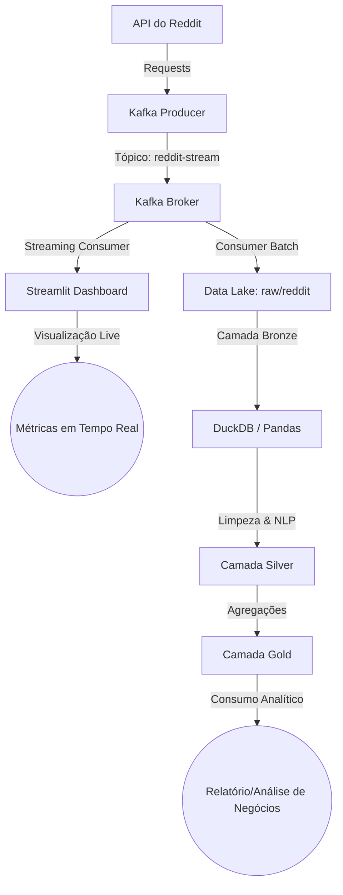

# Proposta Didática de Consumo do Data Lake (Reddit Streaming)

Esta proposta foi elaborada para os alunos da disciplina de **Extração de Dados do IBMEC**. O objetivo é transformar os dados brutos de streaming do Reddit (armazenados no Data Lake local em formato Parquet) em produtos de dados de valor analítico.

---

## 1. Visão Geral da Arquitetura Atual

Atualmente, o projeto `Projeto_Reddit_Streaming` possui a seguinte estrutura:
1. **Producer (`producer.py`)**: Consome a API pública do Reddit (`r/brasil/comments`) e envia os comentários estruturados para o tópico Kafka `reddit-stream`.
2. **Consumer (`consumer.py`)**: Consome as mensagens do tópico Kafka `reddit-stream`, agrupa-as em lotes (batching) e salva-as como arquivos Parquet particionados por data (`ano=YYYY/mes=MM/dia=DD`) na camada `raw` do Data Lake.
3. **Analytics Básico (`gerar_nuvem_palavras.py`)**: Lê os arquivos Parquet do Data Lake, aplica técnicas de NLP simples (limpeza de texto e remoção de stopwords) com NLTK e gera uma Nuvem de Palavras estática.

---

## 2. Proposta Didática de Expansão (O que gerar com os dados?)

Para proporcionar um aprendizado completo sobre pipelines de dados modernos, o projeto foi estendido com **duas abordagens pedagógicas distintas e complementares**:

### Abordagem A: Consumo em Tempo Real (Streaming Analytics)
* **Objetivo**: Mostrar aos alunos o poder do processamento contínuo, onde dados são exibidos ou analisados no exato momento em que chegam ao Kafka.
* **Entregáveis**:
  1. **Análise de Sentimentos em Tempo Real**: Classificar cada comentário novo (positivo, neutro, negativo) usando uma biblioteca leve ou regras léxicas no português.
  2. **Dashboard Interativo Live (Streamlit)**: Um dashboard web que se conecta ao Kafka para plotar gráficos animados:
     - Taxa de comentários por minuto (Volumetria).
     - Distribuição de sentimentos em tempo real.
     - Usuários mais ativos do momento.
     - Alerta de palavras-chave críticas.

### Abordagem B: Consumo Batch / Modern Data Stack (Arquitetura Medalhão)
* **Objetivo**: Ensinar o conceito de Data Lakehouse e engenharia de dados moderna (Bronze -> Silver -> Gold) usando ferramentas modernas e leves como **DuckDB** e **Pandas**.
* **Entregáveis**:
  1. **Camada Bronze (Raw)**: Arquivos Parquet puros salvos pelo `consumer.py`.
  2. **Camada Silver (Cleaned)**: Script de transformação que lê a Bronze, remove duplicatas, separa timestamps em colunas úteis, remove caracteres especiais e categoriza o sentimento/tamanho do texto. Salva em tabelas limpas.
  3. **Camada Gold (Aggregated/Business)**: Criação de visões agregadas para responder perguntas de negócio (ex: volumetria por hora, ranking de usuários, etc.).

---

## 3. Roteiro de Aulas Proposto (Passo a Passo Didático)

### Aula A: O Dashboard em Tempo Real com Streamlit e Kafka
Os alunos implementarão um painel interativo dinâmico que escuta o Kafka diretamente e atualiza as métricas na tela sem recarregar a página.

* **Conceitos Práticos**:
  - Consumo assíncrono em UI.
  - Atualização dinâmica de gráficos no Streamlit (`st.empty()`, `st.line_chart`).
  - Integração direta Python-Kafka no frontend.

### Aula B: Pipeline de Dados com DuckDB (O Canivete Suíço dos Dados)
Os alunos aprenderão a consultar o Data Lake Parquet diretamente com SQL usando DuckDB, demonstrando como a computação serveless/vetorial facilita a análise sobre arquivos Parquet sem a necessidade de subir um cluster Spark pesado.

* **Conceitos Práticos**:
  - Consultar diretórios de arquivos Parquet diretamente por SQL (`SELECT * FROM read_parquet('data_lake/**/*.parquet')`).
  - Criação de tabelas Silver e Gold locais.
  - Registro de funções Python como UDF no SQL (`con.create_function()`).
  - Exportação de relatórios analíticos em formatos executivos.
